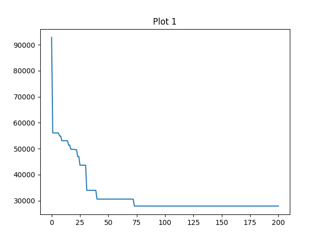
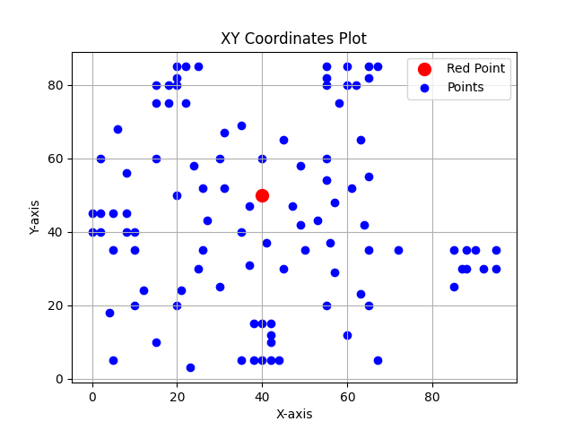
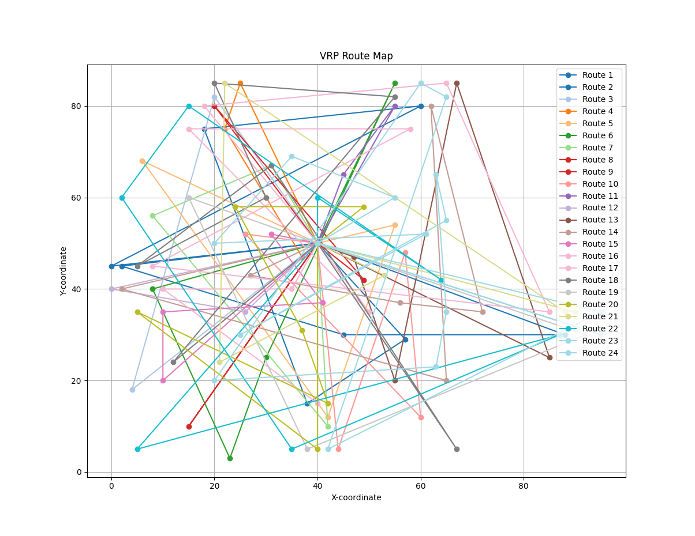

# CVRP

[中文文档](README_zh.md) | [English Documentation](README.md)

## 项目介绍

### 1. 项目目标

**该项目是使用 GA 算法解决理想化场景下的 CVRP 问题。**

### 2. 项目实现

#### 问题分析

1. CVRP 是 NP 问题，本项目选择 GA 来处理

2. 本项目是理论化场景，所以不考虑客户地点的真实地理坐标

3. CVRP 问题的要素

   - 车辆数量
   - 车辆容量
   - 客户配送需求
   - 车辆的起始位置（配送中心）
   - 路径规划

4. 数学描述

   - 有一份客户坐标数据 $C$ ={1, 2, ..., $n$}，其 $C_i = (x_i, y_i)$ ,每个客户$i$有需求量 $q_i$
   - 一个配送中心 $O$
   - $k$辆容量为 $Q$ 的车辆
   - 两点之间的运输成本矩阵 $c_{ij}$，其中
     $c_{ij} =\sqrt{(x_i - x_j)^2 + (y_i - y_j)^2}$
     ,表示两之间的距离和成本
   - 每个客户点必须有且仅有一辆车服务
   - 每辆车的总载荷不得超过容量 $Q$
   - 每辆车的路径必须以配送中心为起点和终点
   - 计算总运输成本最小化

> **我们可以整理上诉内容，用向量形式表示**

- 配送坐标 $O$

- 共用$n$客户数据，其中 $i$ 为客户编号

  - 把每个客户坐标看作一个一个二维向量，
    $v_{i} = [ x_{i}, y_{i} ] $

  - 那么多位客户构成一个坐标矩阵 $V$

    $$
    {V}=
    \begin{bmatrix}
    x_1 & y_1 \\
    x_2 & y_2 \\
    x_3 & y_3 \\
    \vdots & \vdots \\
    x_n & y_n
    \end{bmatrix}
    $$

- 距离矩阵 $D$

  $$
  D =
    \begin{bmatrix}
    d_{11} & d_{12} & \cdots & d_{1n} \\
    d_{21} & d_{22} & \cdots & d_{2n} \\
    \vdots & \vdots & \ddots & \vdots \\
    d_{n1} & d_{n2} & \cdots & d_{nn}
    \end{bmatrix}
  $$

  对于所有节点，距离矩阵表示为
  $D_{ij} = \sqrt{\sum_{k=1}^{2} (V_{i,k} - V_{j,k})^2}$

  两坐标间距离表示为
  $d_{ij} = \|v_i - v_j\|^2 = \sqrt{(x_i - x_j)^2 + (y_i - y_j)^2}$

- 路径表示向量化 $P$

  一条路径 $P$ = [ $0$ , $i_1$, $i_2$, $i_3$, ..., $i_n$, $0$]的总距离，可以表示为

  $$
  L(P) = \sum_{t=1}^{k} d_{i_t, i_{t+1}}
  $$

  定义路径索引向量 $p$ =[ $O$ , $i_1$, $i_2$, ..., $i_n$, $O$]

  结合距离矩阵$D$与路径索引向量 $p$ , 则有表达式

  $$
    L(P) = \sum_{t=1}^{k}D_{p_|t|,p_{t+1}|}
  $$

  其中

  $t$表示路径索引向量 $p$ 的索引

  $p_t$表示路径索引向量 $p$ 的第 $t$ 个元素

  $p_{|t|}$表示路径索引向量 $p$ 的第 $t$ 个元素的绝对值

- 容量约束向量化 $Q$

  每个客户的需求为 $q$ = [ $q_1$ , $q_2$, $q_3$,..., $q_n$]，车辆容量为$Q$。

  路径$P$的总需求可以表示为

  $$
  Q(P) = \sum_{i \in P} q_i
  $$

  容量约束为：

  $$
  Q(P) \leq Q
  $$

#### 结合 GA 解题分析

1. [什么是 GA](#ga理论知识)

### 3. 项目效果

成本最优解迭代驱使图

数据集坐标图，其中红色为配送中心、蓝色为客户

迭代结束最优解路线图

### 4. 项目总结

## 什么是 VRP

车辆路径规划问题（Vehicle Routing Problem，简称 VRP）是指在有限的时间、有限的资源下，为了满足客户需求，将车辆从起点运送到终点，在满足一定条件的前提下，使车辆的行驶总距离最短或总时间最短。

## 常见的 VRP 问题

车辆路径规划 (VRP) 问题有很多种，每种都有其独特的特点和要求。不同的车辆路径规划 (VRP) 问题有不同的解决方案，但它们都有一个共同的目标：找到访问所有客户并返回仓库的最短路线。

### 1. CVRP

在 CVRP 中，每辆车都有一个最大载重量限制，并且每个客户都有一定的需求量。车辆必须在不超过其载重量的情况下，为所有客户提供服务。

### 2. VRPTW

除了车辆的载重量限制外，VRPTW 还考虑了客户的时间窗口。每个客户都有一个可以接受服务的时间范围，车辆必须在这个时间范围内到达客户地点。

### 3. MDVRP

MDVRP 涉及多个仓库（或配送中心），车辆可以从不同的仓库出发，为客户提供服务。目标是找到一种最优的车辆调度方案，使得总行驶距离最短或总成本最低。

### 4. GVRP

GVRP 关注环境因素，如车辆的燃油消耗、尾气排放等。目标是在满足客户需求的同时，最小化车辆的环境影响。

## GA 理论知识

## VRP 问题的应用场景

- 物流配送
- 供应链管理
- 生产调度
- 交通规划
