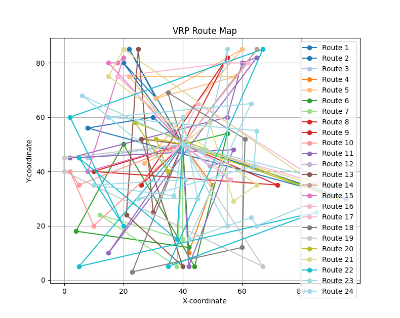

# CVRP

[中文文档](README_zh.md) | [English Documentation](README.md)

## 目录

- [项目介绍](#项目介绍)
  - [1. 项目目标](#1-项目目标)
  - [2. 项目实现](#2-项目实现)
    - [问题分析](#问题分析)
    - [结合 GA 解题](#结合-ga-解题)
    - [运行项目](#运行项目)
  - [3. 项目效果](#3-项目效果)
  - [4. 项目总结](#4-项目总结)
- [相关知识](#相关知识)
  - [什么是 VRP](#什么是-vrp)
  - [常见的 VRP 问题](#常见的-vrp-问题)
  - [GA 理论知识](#ga-理论知识)
    - [GA 概念介绍](#ga-概念介绍)
    - [GA 关键流程](#ga-关键流程)

## 项目介绍

### 1. 项目目标

**该项目是使用 GA 算法解决理想化场景下的 CVRP 问题。**

### 2. 项目实现

#### 问题分析

1. CVRP 是 NP 问题，本项目选择 GA 来处理

2. 本项目是理论化场景，所以不考虑客户地点的真实地理坐标

3. CVRP 问题的要素

   - 车辆数量
   - 车辆容量
   - 客户配送需求
   - 车辆的起始位置（配送中心）
   - 路径规划

4. 数学描述

   - 有一份客户坐标数据 $C$ ={1, 2, ..., $n$}，其 $C_i = (x_i, y_i)$ ,每个客户$i$有需求量 $q_i$
   - 一个配送中心 $O$
   - $k$辆容量为 $Q$ 的车辆
   - 两点之间的运输成本矩阵 $c_{ij}$，其中
     $c_{ij} =\sqrt{(x_i - x_j)^2 + (y_i - y_j)^2}$
     ,表示两之间的距离和成本
   - 每个客户点必须有且仅有一辆车服务
   - 每辆车的总载荷不得超过容量 $Q$
   - 每辆车的路径必须以配送中心为起点和终点
   - 计算总运输成本最小化

> **我们可以整理上诉内容，用向量形式表示**

- 配送坐标 $O$

- 共用 $n$ 客户数据，其中 $i$ 为客户编号

  - 把每个客户坐标看作一个一个二维向量，
    $v_{i} = [ x_{i}, y\_{i} ] $

  - 那么多位客户构成一个坐标矩阵 $V$

    $$
    {V}=
    \begin{bmatrix}
    x_1 & y_1 \\
    x_2 & y_2 \\
    x_3 & y_3 \\
    \vdots & \vdots \\
    x_n & y_n
    \end{bmatrix}
    $$

- 距离矩阵 $D$

  $$
  D =
    \begin{bmatrix}
    d_{11} & d_{12} & \cdots & d_{1n} \\
    d_{21} & d_{22} & \cdots & d_{2n} \\
    \vdots & \vdots & \ddots & \vdots \\
    d_{n1} & d_{n2} & \cdots & d_{nn}
    \end{bmatrix}
  $$

  对于所有节点，距离矩阵表示为
  $D_{ij} = \sqrt{\sum_{k=1}^{2} (V_{i,k} - V_{j,k})^2}$

  两坐标间距离表示为
  $d_{ij} = \|v_i - v_j\|^2 = \sqrt{(x_i - x_j)^2 + (y_i - y_j)^2}$

- 路径表示向量化 $P$

  一条路径 $P$ = [ $0$ , $i_1$, $i_2$, $i_3$, ..., $i_n$, $0$]的总距离，可以表示为

  $$L(P) = \sum_{t=1}^{k} d_{i_t, i_{t+1}}$$

  定义路径索引向量 $p$ =[ $O$ , $i_1$, $i_2$, ..., $i_n$, $O$]

  结合距离矩阵 $D$ 与路径索引向量 $p$ , 则有表达式

  $$L(P) = \sum_{t=1}^{k}D_{p_|t|,p_{t+1}|}$$

  其中

  $t$ 表示路径索引向量 $p$ 的索引

  $p_t$ 表示路径索引向量 $p$ 的第 $t$ 个元素

  $p_{|t|}$ 表示路径索引向量 $p$ 的第 $t$ 个元素的绝对值

- 容量约束向量化 $Q$

  每个客户的需求为 $q$ = [ $q_1$ , $q_2$, $q_3$,..., $q_n$]，车辆容量为 $Q$。

  路径 $P$ 的总需求可以表示为

  $$Q(P) = \sum_{i \in P} q_i$$

  容量约束为：

  $$Q(P) \leq Q$$

#### 结合 GA 解题

1. [什么是 GA](#ga理论知识)

2. [GA 的流程步骤](#ga-关键流程)

3. 将 CVRP 数学问题代入 GA 算法中

   - 1） 初始化种群，随机生成 $k$ 条路径 $P$

   - 2） 计算 $k$ 条路径 $P$ 的适应度 $F$

     我们可以把路径向量索引 $p$ 视作遗传因子，路径 $P$ 可以看作一个染色体。那么结合路径 $P$ 的总距离 $Q(P)$ 和约束适应度函数，便得到该路径的适应度。

     $$
        F(P) = \frac{1}{1 + L(P) + \lambda \cdot \max(0, Q(P) - Q)}
     $$

     其中
     $\lambda$ 表示惩罚因子 （ $\lambda$ 的定义与客需量 $Q$ 有关 ）

   - 3）选择操作

     - 初次选择时只有当前种群，默认进入下一步
     - 比较两个种群的适应度，选择适应度更高的种群保留，进入下一代操作中

   - 4）交叉操作

     - 定义交叉概率 $pc$
     - 根据交叉概率随机生成路径 $P_1$ 和 $P_2$ 的交叉点，通过交换操作生成新的路径$P_3$ 和 $P_4$

   - 5）变异操作

     - 定义变异概率 $pm$
     - 随机选择一条路径 $P$ ，根据变异概率生成路径上的两个变异节点，并交换这两个节点，生成新的路径 $P'$

   - 6）重复步骤 2）-5），直到达到停止条件

#### 运行项目

- python 3.8 +

- 克隆项目后，执行一下命令安装依赖

  ```

  pip3 install -r requirements.txt

  ```

- 运行`main.py`

### 3. 项目效果

成本最优解迭代驱使图


数据集坐标图，其中红色为配送中心、蓝色为客户


迭代结束最优解路线图



### 4. 项目总结

 首先是代码实现比较稚嫩，涉及相关向量的转换和 GA 算法均未使用其他第三方库或模型进行处理。其次，当前命题是基于理论上进行分析实现的，建议结合多维向量或维护一份向量数据库做进一步的研究和改进。最后，项目实现可能存在BUG，欢迎大家提出问题，但大概率不再进行过多调整😁。

## 相关知识

### 什么是 VRP

车辆路径规划问题（Vehicle Routing Problem，简称 VRP）是指在有限的时间、有限的资源下，为了满足客户需求，将车辆从起点运送到终点，在满足一定条件的前提下，使车辆的行驶总距离最短或总时间最短。

### 常见的 VRP 问题

车辆路径规划 (VRP) 问题有很多种，每种都有其独特的特点和要求。不同的车辆路径规划 (VRP) 问题有不同的解决方案，但它们都有一个共同的目标：找到访问所有客户并返回仓库的最短路线。

#### 1. CVRP

在 CVRP 中，每辆车都有一个最大载重量限制，并且每个客户都有一定的需求量。车辆必须在不超过其载重量的情况下，为所有客户提供服务。

#### 2. VRPTW

除了车辆的载重量限制外，VRPTW 还考虑了客户的时间窗口。每个客户都有一个可以接受服务的时间范围，车辆必须在这个时间范围内到达客户地点。

#### 3. MDVRP

MDVRP 涉及多个仓库（或配送中心），车辆可以从不同的仓库出发，为客户提供服务。目标是找到一种最优的车辆调度方案，使得总行驶距离最短或总成本最低。

#### 4. GVRP

GVRP 关注环境因素，如车辆的燃油消耗、尾气排放等。目标是在满足客户需求的同时，最小化车辆的环境影响。

### GA 理论知识

#### GA 概念介绍

遗传算法（Genetic Algorithm，GA）是一种模拟自然界进化过程的优化算法。它通过模拟生物进化中的选择、交叉和变异等操作，来寻找最优解。

- 选择（Selection）：根据个体的适应度，选择优秀的个体进入下一代。
- 交叉（Crossover）：通过随机选择两个父代，交换部分染色体，生成新的子代。
- 变异（Mutation）：随机改变个体的染色体，增加种群的多样性。

#### GA 关键流程


1. 初始化种群

   - 随机生成一组初始解，作为种群的初始状态。

2. 适应度评估

   - 定义一个适应度函数，用于评估每个个体的质量。
   - 计算每个个体的适应度，即解的质量。

3. 选择

   - 根据个体的适应度，选择优秀的个体进入下一代。
   - 常见方法： 金鹰保留策略、轮盘赌选择、锦标赛选择等。

4. 交叉

   - 随机选择两个父代，交换部分染色体，生成新的子代。
   - 常见方法：单点交叉、多点交叉、均匀交叉等。

5. 变异

   - 随机改变个体的染色体，增加种群的多样性。

6. 更新种群

   - 将新生成的子代替换掉原种群中适应度较低的个体。

7. 判断是否满足终止条件

   - 如果满足终止条件，输出最优解；否则，返回步骤 2。

8. 输出最优解
   - 根据适应度函数，选择适应度最高的个体作为最优解。

### VRP 问题的应用场景

- 物流配送
- 供应链管理
- 生产调度
- 交通规划
