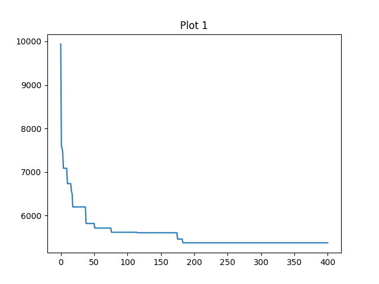

# CVRP

[中文文档](README_zh.md) | [English Documentation](README.md)

## 项目介绍

### 1. 项目目标

**该项目是使用GA算法解决理想化场景下的CVRP问题。**

### 2. 项目实现

#### 问题分析
    
1. CVRP是NP问题，本项目选择GA来处理
2. 本项目是理论化场景，所以不考虑客户地点的真实地理坐标
3. 定义CVRP问题的要素
- 车辆数量
- 车辆容量
- 客户配送需求
- 车辆的起始位置（配送中心）
- 路径规划

#### GA理论知识

### 3. 项目效果

成本最优解迭代驱使图

数据集坐标图，其中红色为配送中心、蓝色为客户

迭代结束最优解路线图

### 4. 项目总结

## 什么是 VRP

车辆路径规划问题（Vehicle Routing Problem，简称 VRP）是指在有限的时间、有限的资源下，为了满足客户需求，将车辆从起点运送到终点，在满足一定条件的前提下，使车辆的行驶总距离最短或总时间最短。

## 常见的 VRP 问题

车辆路径规划 (VRP) 问题有很多种，每种都有其独特的特点和要求。不同的车辆路径规划 (VRP) 问题有不同的解决方案，但它们都有一个共同的目标：找到访问所有客户并返回仓库的最短路线。

### 1. CVRP

在 CVRP 中，每辆车都有一个最大载重量限制，并且每个客户都有一定的需求量。车辆必须在不超过其载重量的情况下，为所有客户提供服务。

### 2. VRPTW

除了车辆的载重量限制外，VRPTW 还考虑了客户的时间窗口。每个客户都有一个可以接受服务的时间范围，车辆必须在这个时间范围内到达客户地点。

### 3. MDVRP

MDVRP 涉及多个仓库（或配送中心），车辆可以从不同的仓库出发，为客户提供服务。目标是找到一种最优的车辆调度方案，使得总行驶距离最短或总成本最低。

### 4. GVRP

GVRP 关注环境因素，如车辆的燃油消耗、尾气排放等。目标是在满足客户需求的同时，最小化车辆的环境影响。

## VRP 问题的应用场景

- 物流配送
- 供应链管理
- 生产调度
- 交通规划
